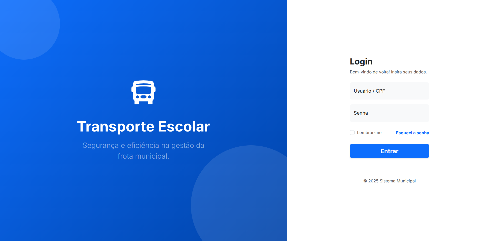

# Sistema de Gerenciamento de Transporte Escolar

  
  
  
  

---

## 1. Objetivo do sistema

O *Sistema de Transporte Escolar* é uma solução web para apoiar prefeituras e secretarias de educação no gerenciamento da frota escolar municipal.  
O objetivo é centralizar informações de *alunos, **motoristas, **veículos* e *rotas, substituindo planilhas manuais por uma plataforma que integra **Gestores, **Motoristas* e *Alunos* em um mesmo ambiente.

---

## 2. Principais funcionalidades

### Módulo Gestor (Administrativo)
- Dashboard com visão geral das rotas, veículos e alertas.
- Cadastro e gestão de veículos, motoristas e alunos.
- Upload e controle de validade da declaração escolar do aluno.
- Alertas para CNH vencida e cadastros de alunos a renovar.
- Criação de rotas, definição de horários e alocação de alunos.

### Módulo Motorista (Painel Operacional)
- Visualização apenas das rotas atribuídas ao motorista logado.
- Lista de passageiros por rota com situação do aluno:
  - Sem confirmação, confirmou *ida, **volta* ou *ida e volta*.
- Registro de ocorrências (problemas mecânicos, atrasos, aluno ausente etc.).

### Módulo Aluno (Portal do Aluno)
- Confirmação diária de presença na rota:
  - Botões separados para *“Vou na Ida”* e *“Vou na Volta”*.
- Visualização da(s) rota(s) em que está cadastrado, com veículo e horário previsto.

---

## 3. Tecnologias utilizadas

- *Linguagem:* Python 3.10+
- *Framework backend:* Django 5.0
- *Frontend:* HTML5, CSS3, Bootstrap 5.3, Django Templates
- *Banco de dados (desenvolvimento):* SQLite
- *Controle de versão:* Git e GitHub
- *Metodologia de organização:* Kanban

---

## 4. Como executar o projeto

Pré-requisitos:  
- Git instalado  
- Python 3.10+ instalado

### 4.1 Clonar o repositório

git clone https://github.com/ViniciusOliver13/Gerenciamento-Transporte-Escolar.git
cd Gerenciamento-Transporte-Escolar

### 4.2 Criar e ativar o ambiente virtual

# Windows
python -m venv venv
.\venv\Scripts\activate

# Linux/Mac
python3 -m venv venv
source venv/bin/activate

### 4.3 Instalar as dependências

pip install -r requirements.txt

### 4.4 Configurar o banco de dados

python manage.py makemigrations
python manage.py migrate

### 4.5 (Opcional) Criar um superusuário

python manage.py createsuperuser

### 4.6 Executar o servidor

python manage.py runserver

Acesse em: http://127.0.0.1:8000/

---

## 5. Como navegar/testar o protótipo

1. Acesse o painel administrativo em http://127.0.0.1:8000/admin/ com o superusuário criado.  
2. Cadastre:
   - Veículos, motoristas e alunos.
   - Rotas, associando veículo, motorista e alunos.
3. Crie usuários para cada perfil (ou vincule usuários existentes):

| Usuário (exemplo) | Perfil            | Acesso principal                      |
|-------------------|-------------------|---------------------------------------|
| admin           | Gestor            | Gestão completa via /admin e painéis  |
| motorista1      | Motorista         | Painel do motorista, “Minhas Rotas”   |
| aluno1          | Aluno             | Painel do aluno, confirmação ida/volta|

4. Faça login como:
   - *Aluno: acesse o painel do aluno, confirme **ida* e/ou *volta* em uma rota.  
   - *Motorista*: veja no painel do motorista a lista de passageiros e o status de confirmação de cada aluno.  
   - *Gestor*: gerencie cadastros, rotas e acompanhe o funcionamento geral.

## Screenshots

### Tela de Acesso (Login Unificado)

A interface direciona automaticamente cada perfil para seu painel específico

## 6. Integrantes do grupo

<table align="center">
  <tr>
    <td align="center">
      <a href="https://github.com/ViniciusOliver13">
         
        <b>Antonio Vinicius</b>
      </a>
    </td>
    <td align="center">
      <a href="https://github.com/marceloDev0">
         
        <b>Marcelo Augusto</b>
      </a>
    </td>
    <td align="center">
      <a href="https://github.com/thyagofab">
         
        <b>Thyago Fabricio</b>
      </a>
    </td>
    <td align="center">
      <a href="https://github.com/dinarteefilho">
         
        <b>Dinarte Rodrigues</b>
      </a>
    </td>
  </tr>
</table>
